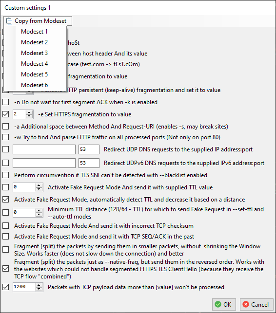

# GDPIControl - GoodbyeDPI Tray Control

Small tray application for controlling GoodbyeDPI

## Features

- Switching GoodbyeDPI on/off from tray
- Selecting custom options
- Updating blacklist
- Autostart at logon

## Screenshots

Tray window  

Main window  

## Links

- **[WinDivert](https://github.com/basil00/Divert)** by @basil00
- **[GoodbyeDPI](https://github.com/ValdikSS/GoodbyeDPI/)** by @ValdikSS
