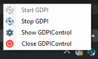
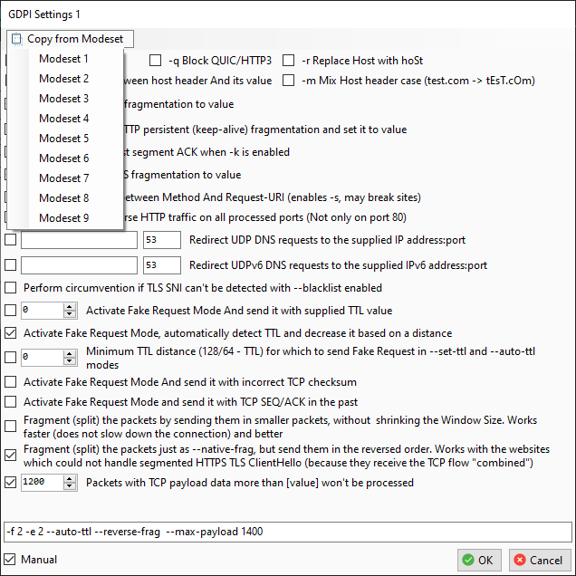

# GDPIControl - GUI for [GoodbyeDPI](https://github.com/ValdikSS/GoodbyeDPI/)

Small GUI application for controlling GoodbyeDPI

## Features

- Enable/disable Goodbye DPI from the tray
- Custom settings (up to 3)
- Updating the blacklist
- Autorun at login

## Screenshots

Tray menu  

Main window  

Custom settings  

## Links

- **[GoodbyeDPI](https://github.com/ValdikSS/GoodbyeDPI/)** by @ValdikSS
- **[WinDivert](https://github.com/basil00/Divert)** by @basil00
